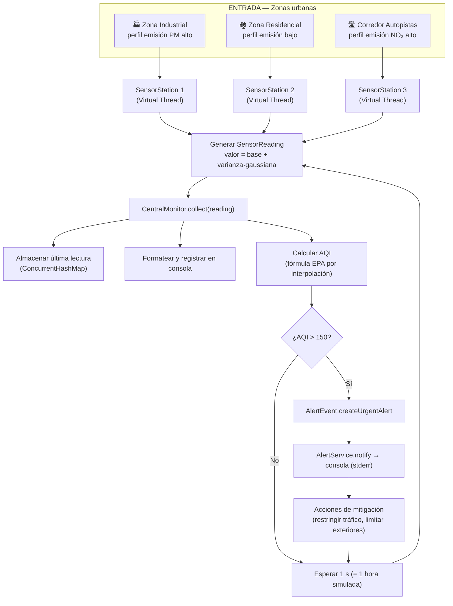
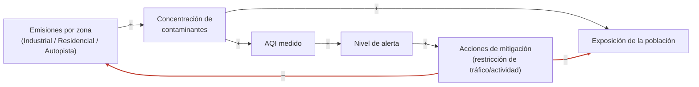
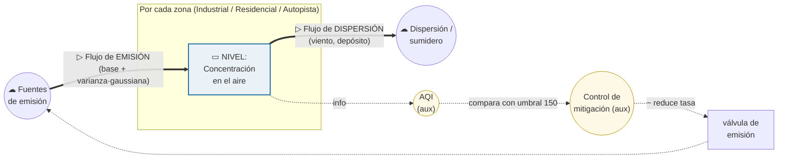

# Diagramas del Sistema (Teoría General de Sistemas)

> Este documento reúne los tres diagramas que describen el sistema de monitoreo
> de calidad del aire desde la óptica de la **Teoría General de Sistemas (TGS)**:
>
> 1. **Diagrama de Proceso** — *qué hace* el sistema, paso a paso.
> 2. **Diagrama de Influencia** — *cómo se relacionan* las variables (causa-efecto, bucles).
> 3. **Diagrama de Forrester** — *cómo se acumula y fluye* la materia/información (niveles y flujos).
>
> Los diagramas están escritos en **Mermaid** (se renderizan automáticamente en
> GitHub, GitLab, VS Code con la extensión *Markdown Preview Mermaid*, Obsidian,
> etc.) y, donde ayuda, se acompañan de una versión ASCII para imprimir.

---

## Contexto: las 3 zonas del modelo

La ciudad simulada se divide en **3 zonas**, cada una con un perfil de emisión
distinto (definido en `ZoneProfile.java`). Esto es clave para los diagramas:
la *entrada* del sistema no es homogénea.

| Zona | Estación | Contaminante dominante | Comportamiento |
|---|---|---|---|
| 🏭 **Industrial** | `EST-001-INDUSTRIAL` | PM2.5 / PM10 | Partículas altas por combustión y manufactura |
| 🏘️ **Residencial** | `EST-002-RESIDENCIAL` | (bajo) | Tráfico ligero y calefacción; aire limpio |
| 🛣️ **Autopistas** | `EST-003-AUTOPISTA` | NO₂ | Tráfico vehicular intenso; NO₂ muy elevado |

---

## 1. Diagrama de Proceso

Describe el **flujo de actividades** desde que cada zona genera una medición
hasta que el sistema decide (o no) emitir una alerta y ejecutar mitigación.
Es la vista de "línea de producción" del sistema.



**Versión ASCII (resumida):**

```
[Zona] → [SensorStation/VThread] → genera lectura
                                        │
                                        ▼
                            CentralMonitor.collect()
                              ├─ almacena
                              ├─ registra en consola
                              └─ calcula AQI ──► ¿AQI > 150?
                                                   │
                                          no ◄─────┴─────► sí
                                          │               │
                                       esperar         ALERTA + mitigación
                                       1 s = 1 h           │
                                          └──── ciclo ◄────┘
```

---

## 2. Diagrama de Influencia (bucle causal)

Muestra las **relaciones causa-efecto** entre las variables del sistema y los
**bucles de retroalimentación**. Cada flecha indica el sentido de la influencia:

- **`+`** : si la variable de origen aumenta, la de destino también (mismo sentido).
- **`−`** : si la variable de origen aumenta, la de destino disminuye (sentido opuesto).



**Bucle de retroalimentación negativa (balanceador `B`)** — es el que da
*homeostasis* al sistema:

```
   Emisiones (+)→ Concentración (+)→ AQI (+)→ Alerta (+)→ Mitigación
        ▲                                                      │
        └──────────────────── (−) ─────────────────────────────┘

   Más AQI ⇒ más alerta ⇒ más mitigación ⇒ MENOS emisiones ⇒ baja el AQI.
   Es un bucle BALANCEADOR (B): tiende a estabilizar el sistema.
```

> **Lectura TGS:** este bucle balanceador es el mecanismo de **autorregulación
> (homeostasis)**. El umbral `AQI > 150` actúa como punto de referencia
> (*setpoint*) del control. Sin el bucle de mitigación, las emisiones no
> tendrían freno y el sistema sería de lazo abierto.

---

## 3. Diagrama de Forrester (niveles y flujos)

Es la vista de **dinámica de sistemas**: distingue entre

- **Niveles / Stocks** (rectángulos) — acumulaciones que cambian en el tiempo
  (ej. la masa de contaminante en el aire de una zona).
- **Flujos** (válvulas ▷) — tasas que *llenan* o *vacían* los niveles.
- **Variables auxiliares** (círculos/óvalos) — cálculos intermedios (ej. el AQI).
- **Nubes** (☁) — fuentes y sumideros fuera de la frontera del sistema.



**Versión ASCII (notación clásica de Forrester):**

```
   ☁                  ┌─────────────────────────┐                 ☁
 Fuentes  ──▷══════►  │  NIVEL: Concentración   │  ══════▷──►  Dispersión
 emisión   (flujo de  │  de contaminante (aire) │   (flujo de   /sumidero
            emisión)  └───────────┬─────────────┘   dispersión)
                ▲                  ┊ (información)
                ┊                  ▼
                ┊            (  AQI  )  ◄ variable auxiliar
                ┊                  ┊
                ┊                  ▼
                ┊        ( Control de mitigación )
                ┊                  ┊  compara con umbral = 150
                └────── (−) ───────┘
            la válvula de emisión se cierra cuando AQI supera el umbral
```

**Equivalencia entre el modelo y el código:**

| Elemento Forrester | En el código | Detalle |
|---|---|---|
| Nivel (stock) | concentración por `Pollutant` en `SensorReading` | Acumulación medida cada "hora" |
| Flujo de emisión | `ZoneProfile.base()` + `variance()` × gaussiana | Tasa de entrada según la zona |
| Variable auxiliar AQI | `AqiCalculator.calculateOverallAqi()` | Interpolación EPA del peor contaminante |
| Control / setpoint | `AirQualityCategory.requiresUrgentMitigation()` (`AQI > 150`) | Punto de referencia del control |
| Acción del control | `AlertService.notify()` → mitigación | Cierra la "válvula" de emisión |

---

## Cómo editar o regenerar estos diagramas

- **Mermaid (recomendado):** edita los bloques ` ```mermaid ` directamente en
  este archivo. Para previsualizar usa el [Mermaid Live Editor](https://mermaid.live)
  o la extensión de VS Code *Markdown Preview Mermaid Support*.
- **Herramientas de dinámica de sistemas (para el de Forrester):** si quieres
  una versión ejecutable/simulable del modelo de Forrester, puedes reproducirlo
  en [Vensim PLE](https://vensim.com/free-download/) (gratuito para uso académico),
  [Stella](https://www.iseesystems.com/) o [InsightMaker](https://insightmaker.com/)
  (web y gratuito).
- **Diagramas vectoriales:** para una versión "limpia" para la presentación,
  [draw.io / diagrams.net](https://app.diagrams.net) importa Mermaid y permite
  exportar a PNG/SVG/PDF.

---

## Resumen de los tres diagramas

| Diagrama | Pregunta que responde | Foco TGS |
|---|---|---|
| **Proceso** | ¿Qué pasos ejecuta el sistema? | Estructura funcional / secuencia |
| **Influencia** | ¿Cómo se afectan las variables entre sí? | Bucles de retroalimentación / homeostasis |
| **Forrester** | ¿Qué se acumula y a qué tasa fluye? | Niveles, flujos y dinámica temporal |
